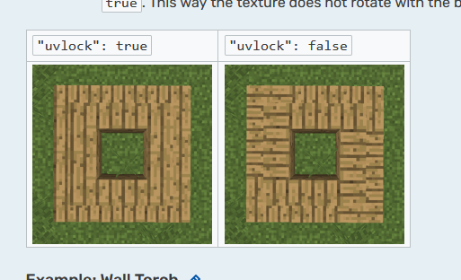

# Lock UV

Lock UV will lock the rotation of the controllers texture, this prevents the texture from rotating when you build the machine on different axis rotations.

E.g. when the machine is built facing north the texture will be facing the player, if you build the same structure facing east the texture will be rotated to match the direction, if this option is set to true it will prevent this from happening. 



Example
```json
"lockUV": boolean
```