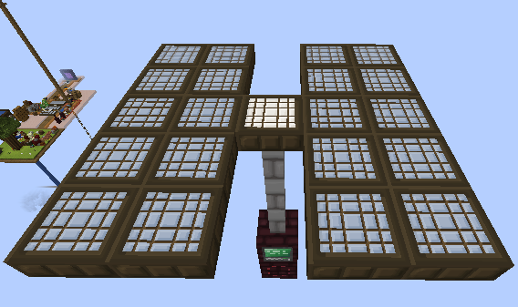

# Solar Panel 
This structure is a solar panel it uses blockstates to check what time of day it is then produce 50 RF per tick.

[Controller File](./controller) --- [Port File](./port)

[Structure File](./structure) --- [Recipe File](./process)