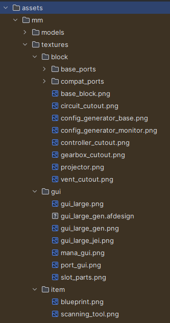
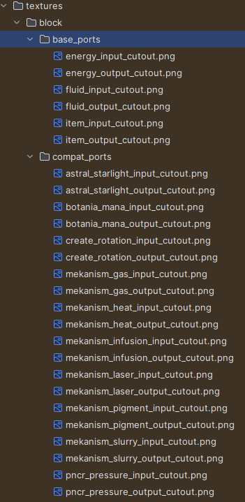

# Textures

To replace a texture in MM you need to have a valid resource pack, you can get one [HERE](../assets/downloads/solar_panel_resource_pack.zip)

Inside that texture pack you will see a folder called `assets` and a file called `pack.mcmeta`

You can open the pack.mcmeta as a text file so any notepad editor program will work. 

Open the assets folder to see the namespace of the mods textures we want to replace, in this case we want to replace mm's textures, so we have a mm folder

Inside the mm folder we have either models or textures we want textures this time

Once inside the textures folder you will want to create a folder for either
1. `block` - to change a blocks texture
2. `gui` - to change a gui texture
3. `item` - to change a item texture

To change a Controller or Port block texture to something that isnt in your game already you will need to put your new texture.png file into `assets/mm/textures/block/solar_panel_controller.png` where `solar_panel_controller.png` is the exact block id that can be found ingame by pressing F3(debug screen) then looking at a block.

| :information_source:  If the texture is already loaded into your game via another mod change the models file of the controller or port rather than the texture. |
|-----------------------------------------------------------------------------------------------------------------------------------------------------------------|

| :information_source:  This way if a player has a texture pack on that changes the original block your MM blocks will take on the new textures automatically.                |
|-----------------------------------------------------------------------------------------------------------------------------------------------------------------------------|

